# **Manual de Uso para Programa Administrador de Adopción de Perros mediante Pycharm en Windows**

## **Alcance y Audiencia**
Este manual de uso se dirige a usuarios que necesiten un programa de administración de adopciones de perros, mediante Pycharm en computadoras con sistema operativo Windows. Se tiene como objetivo ofrecer instrucciones claras y sencillas para ayudar al usuario a poder usar el programa de manera sencilla y sin inconvenientes, se requiere tener conocimientos básicos en el manejo de computadoras.

## **Resumen**
Este documento proporciona instrucciones paso a paso de principio a fin sobre como utilizar el administrador de adopciones de perros desarrollado en el lenguaje de programación Python. Entre los pasos encontraremos la descarga de elementos pertinentes en conjunto con la explicación del uso del programa.

## **Indíce**
* [Introducción](#introducción)
* [Instalación de Python](#a-instalación-de-python)
* [Instalación de Pycharm o IDE](#b-instalación-de-pycharm-o-ide)
* [Abrir el Programa en Pycharm](#c-abrir-el-programa-en-pycharm)
* [Descripción del Código](#d-descripción-del-código)
* [Funcionamiento General del Programa](#e-funcionamiento-general-del-programa)
* [Ingresar un Animalito](#f-ingresar-un-animalito)
* [Imprimir los Animalitos Disponibles](#g-imprimir-los-animalitos-disponibles)
* [Adoptar un Animalito](#h-adoptar-un-animalito)
* [Salir](#i-salir)

## **Introducción**
Este documento proporciona instrucciones sobre la utilización de el administrador de adopciones de perros, se explicará la serie de pasos para  utilizar el programa en su manera más óptima y sencilla.

## **A. Instalación de Python**
1. Partimos bajo la instalación de los elementos necesarios para la ejecución del código, en este caso nuestra primera descarga será del lenguaje de programación que la computadora debe interpretar para ello nos dirigiremos a el siguiente enlace.

    [Enlace de Descarga de Python](https://www.python.org/downloads/)

2. Dentro del Enlace presionaremos el boton de Downlowad Python como se indica en la imagen.
    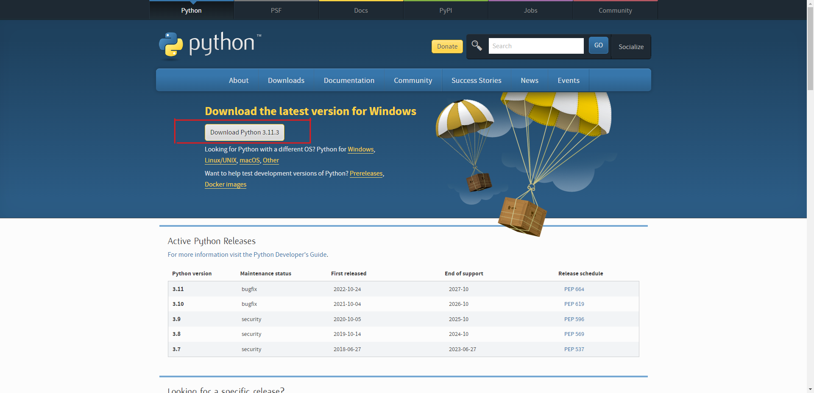

3. En automático nos aparecerá el inicio de descarga como la siguiente (Dependiendo el navegador es la como se ve el inicio de descarga la imagen es tomada desde el navegador Chrome)
    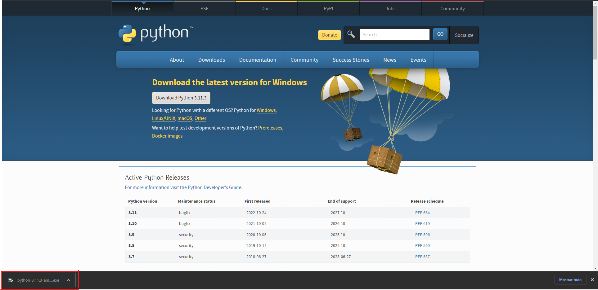

4. Posteriormente presionaremos sobre el Iniciador es decir sobre la  descarga una vez que finalizó, esto nos abrirá una ventana en automático como la que se muestra en la siguiente imagen seleccionaremos la opción "Instalar Ahora, posterior a ello le daremos permisos y después de esperar a que termine la instalación estaría terminada.

    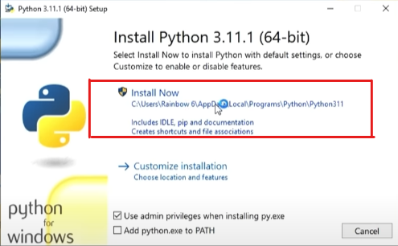  
     
     
    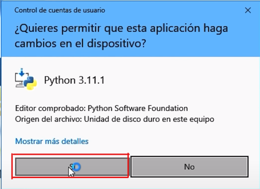

## **B. Instalación de Pycharm o IDE**
1. Para ejecutar nuestro código de manera comoda usaremos una IDE, para ello descargaremos Pycharm, en el enlace de abajo nos redireccionará a la página de desacarga, seleccionaremos en el área marcada y esperaremos.

    [Enlace de Descarga de Pycharm](https://www.jetbrains.com/pycharm/download/#section=windows)
     
    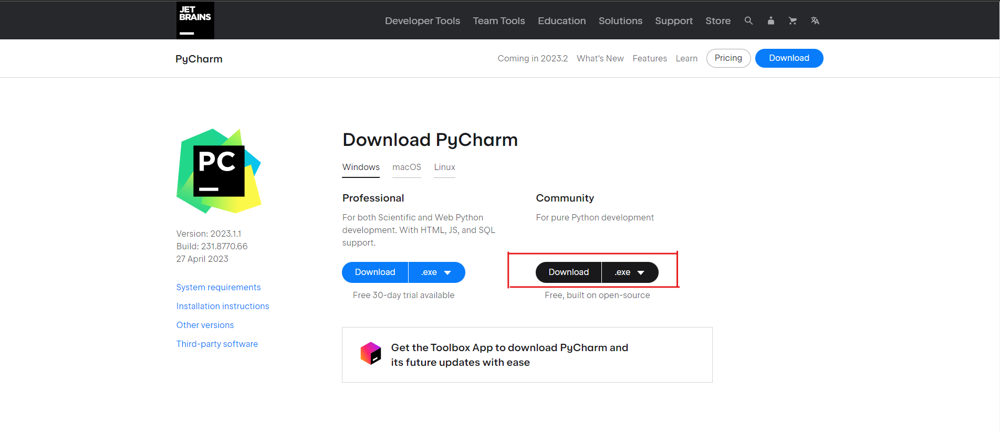  
     

2. En automático comenzará la descarga y se verá reflejada de la misma manera que en la descarga de python, posterior a ello presionaremos la descarga para iniciar la instalación.

    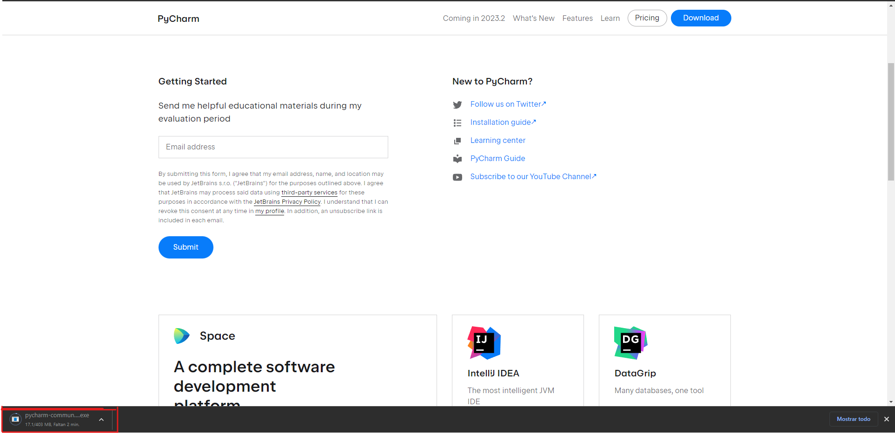 

3. Al ejecutar el instalador nos aparecerán algunas opciones, para el uso del programa no es necesario marcar ninguna, por lo cual dejaremos los valores predeterminados del programa y daremos siguiente para continuar con la instalación, esperaremos a que se instale y estaría listo.

    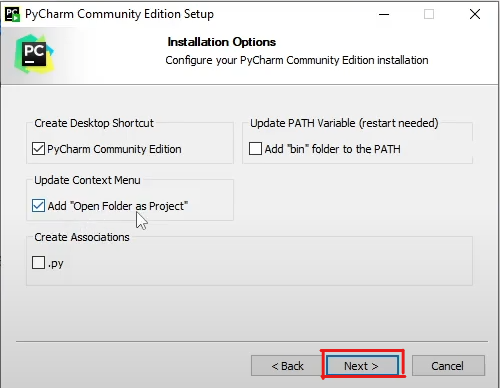 

## **C. Abrir el Programa en Pycharm** 

1. Para poder ejecutar nuestro programa, es necesario abrirlo en Pycharm,  existen 2 formas la primera es desde el acceso directo generado en el escritorio, como se muestra en la siguiente imagen.

      
    La segunda opción que tenemos es buscar directamente el acceso directo para ello iremos a la barra de busqueda de Windows  buscaremos Pycharm como se muestra en las imágenes.

    
     
     
    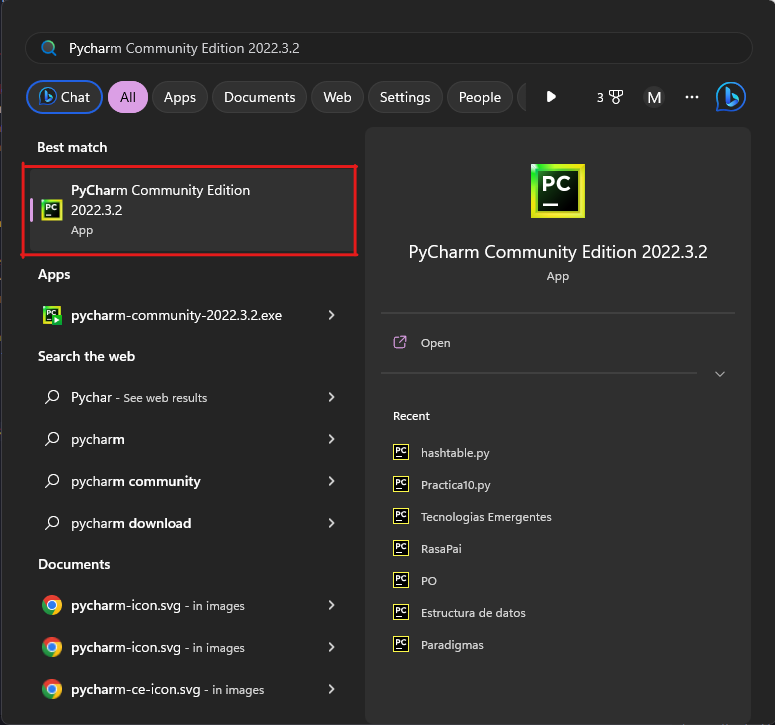

2. Una vez  dentro del programa seleccionaremos en el botón superior con forma de 3 líneas e iremos al apartado de archivo, y luego abrir.
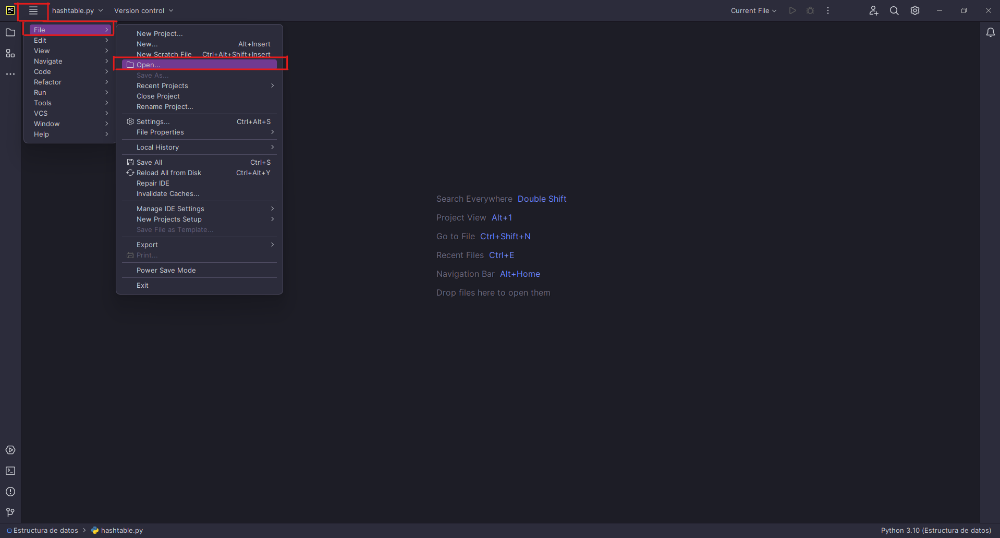

3. Finalmente Buscaremos en la ruta donde lo descargamos,o la ruta por defecto de descargas de nuestro explorador de archivos.
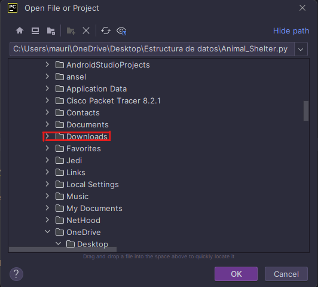

Posterior a esto seleccionaremos el archivo de todos los descargados, en este caso el archivo tiene el nombre de Animal_Shelter.py asi que lo seleccionaremos como en la imagen y pondremos Ok.

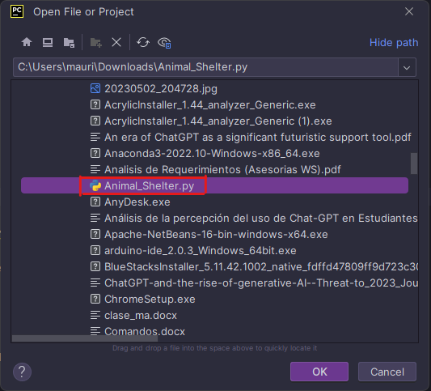

## **D. Descripción del Código**

**Clases y Dependencias**

El código comienza con la importación del módulo "datetime", el cual se utilizará para obtener la fecha y hora de entrada de los Animalitos al sistema.

Posterior a lo antes mencionado, se define la clase "Animal", que representa en este caso un perrito, donde el constructor __ init __ recibe los argumentos nombre, edad, raza y fecha de ingreso del animal.  Estos atributos se asignan a las variables de instancia correspondientes (self.name, self.age, self.breed, self.date). Además, se inicializa el atributo self.next como None, que se utilizará más adelante para enlazar los nodos en la cola.

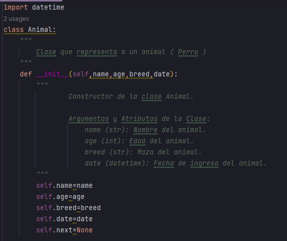

 
 
Por otra parte se encuentra la clase "Queue", que representa una cola de adopción de animales. El constructor __init__ inicializa los atributos self.first (apunta al primer animal de la cola), self.length (indica la cantidad de animales en la cola) y self.last (apunta al último animal de la cola)

 
 
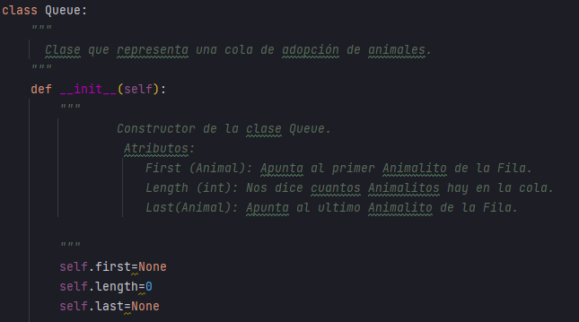
 
 

**Métodos**

La clase Queue también tiene tres métodos principales:
1. El método **dog_enqueue** se utiliza para agregar un perro a la cola de adopción. Recibe los argumentos name, age y breed, crea un nuevo objeto Animal con esos valores y la fecha actual, y lo agrega al final de la cola. Si la cola está vacía, tanto self.first como self.last se establecen en el nuevo nodo. Después de agregar el perrito, se incrementa el contador de longitud (self.length).

     
    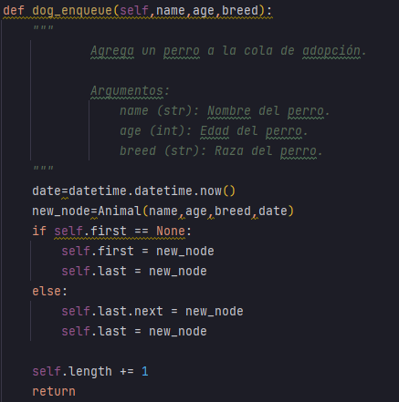
     
 

2. El método **print_queue** imprime los animales disponibles en la cola de adopción. Itera sobre los nodos de la cola y muestra el nombre, la edad, la raza y la fecha de ingreso de cada animal.
 
    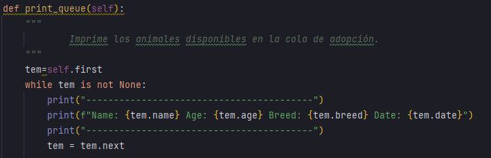
      

3. El método **dog_dequeue** se utiliza para adoptar un perro de la cola y eliminarlo de la misma. Retorna el perro adoptado o False si la cola está vacía. Si la cola no está vacía, se asigna self.first al siguiente nodo en la cola y se desconecta el primer nodo. Luego, se decrementa el contador de longitud.
 
    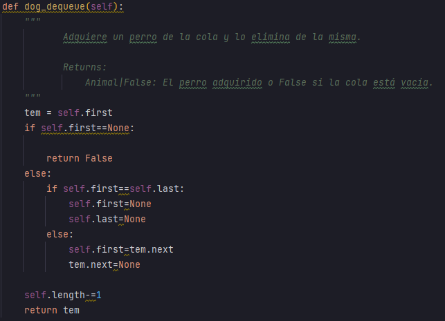
      

Después de definir la clase Queue, se crea una instancia de esta clase llamada my_queue.

**Menú**

Finalmente, se muestra un menú de selección con las siguientes opciones:

1. **Ingresar un animalito:** Permite ingresar el nombre, edad y raza de un animalito y lo agrega a la cola de adopción utilizando el método dog_enqueue de my_queue.

2. **Imprimir los animalitos disponibles:** Muestra los animales disponibles en la cola de adopción utilizando el método print_queue de my_queue.

3. **Adoptar un animalito:** Adopta un animalito de la cola utilizando el método dog_dequeue de my_queue. Si la cola está vacía, se muestra un mensaje indicando que no hay más animalitos en adopción.

4. **Salir:** Termina el programa.

El código se ejecuta en un bucle while True para que el menú se muestre continuamente hasta que se seleccione la opción de salir. Cada opción del menú se implementa utilizando una estructura match para evaluar la opción seleccionada por el usuario. A continuación se describen las acciones realizadas para cada caso:

**Caso 1:** Si se selecciona la opción 1, se solicita al usuario que ingrese el nombre, la edad y la raza del animalito. Luego, se llama al método dog_enqueue de my_queue para agregar el animalito a la cola de adopción.

**Caso 2:** Si se selecciona la opción 2, se llama al método print_queue de my_queue para imprimir los animalitos disponibles en la cola de adopción.

**Caso 3:** Si se selecciona la opción 3, se llama al método dog_dequeue de my_queue para adoptar un animalito de la cola. Si la cola está vacía, se muestra un mensaje indicando que no hay más animalitos en adopción. En caso contrario, se imprime la información del animalito adoptado.

**Caso 4:** Si se selecciona la opción 4, se muestra un mensaje de despedida y se utiliza el comando exit() para finalizar el programa.

Después de cada iteración del bucle, se vuelve a mostrar el menú para que el usuario seleccione una opción.

En resumen, este código implementa un programa interactivo que permite agregar, imprimir y adoptar animalitos en una cola de adopción. Utiliza las clases Animal y Queue para representar los animalitos y la cola, respectivamente. El menú de selección permite al usuario interactuar con el programa y realizar las operaciones deseadas.

## **E. Funcionamiento General del Programa**
1. Para comenzar con el uso de nuestro programa es necesario ejecutarlo, para ello basta con solo presionar el botón del triángulo verde de pycharm.

    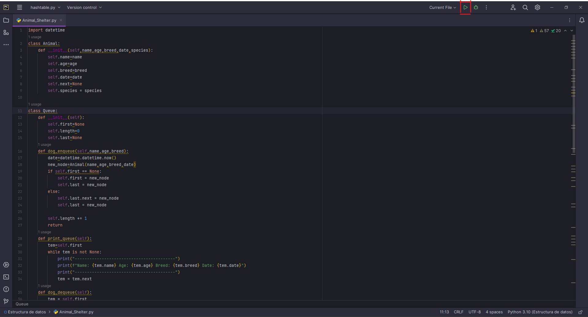

2. Al ejecutar nuestro código nos aparecerá la consola con un pequeño menú de opciones o funciones que el código tiene, como se muestra en la siguiente imagen.
    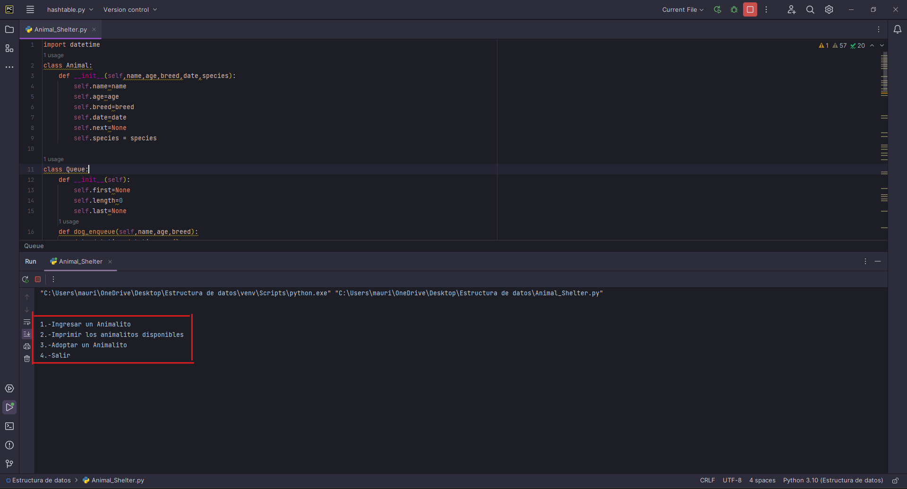

3. Para acceder a cualquier función bastará con ingresar el número que te indica, a continuación se explica de manera general que hace cada función.
     

    **1.Ingresar un Animalito:**
    Como su nombre lo indica es para guardar en el registro de animales un nuevo animalito disponible para adoptar, es importante decir que la manera en que ingresan es la manera en que se pueden adoptar, es decir, si X Perrito fue el primero en ser ingresado al centro de adopción el propio sistema es el que dará en adopción primero.

      

    **2.Imprimir los Animalitos disponibles**
    Esta función nos permite ver la lista de Animalitos en espera de Adopción.

      

    **3.Adoptar Animalito**
    Finalmente este método se encarga de la adopción, es decir, nos dice todos los datos del perrito adoptado y lo elimina de los animalitos en espera de adopción.

      

    **4.Salir**
    La función salir es para terminar la ejecución del programa.
      
**Es importante mencionar que al finalizar cada función el menú se ejecutará de nuevo hasta que se finalice el programa, al finalizar los animalitos ingresados serán eliminados, pues no existe un conexión con base de datos o guardado de datos en un archivo**

## **F. Ingresar un Animalito**
Ingresar un perrito es sencillo, el programa te pedirá cierta información como su edad,raza y nombre, al guardar cada dato deberás presionar enter para que pase a la siguiente instrucción, en la imagen se puede apreciar todo lo que la función ingresar realiza, que basicamente es el guardado de información y registro del animalito.
     
    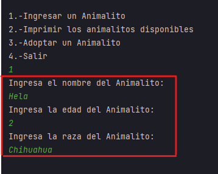

## **G. Imprimir los Animalitos Disponibles**
La función imprimir solo muestra la lista de todos los animalitos registrados como la imagen lo muestra, en caso de no existir ninguno, no mostrará nada, junto al animalito se imprimirá toda su información junto a su fecha de y hora de registro.
 
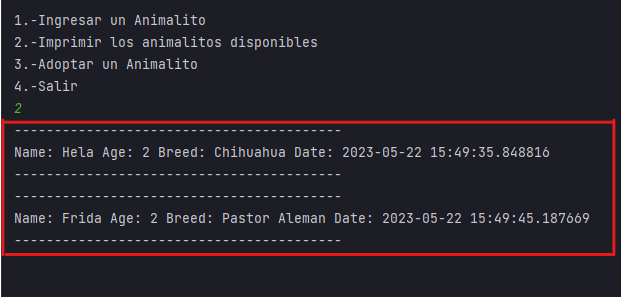

## **H. Adoptar un Animalito**
Al ejecutar la función en automático elimina al perrito del registro y nos dice los datos del mismo, como se basa en que los perritos que más tiempo tienen de espera sean los primeros adoptados, no existe un opción de seleccionar el animalito deseado.
 
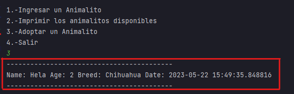

## **I. Salir**
Al ejecutar la función salir, el programa nos avisará que está saliendo y finalizará la ejecución de nuestro programa como se aprecia en la imagen.
 
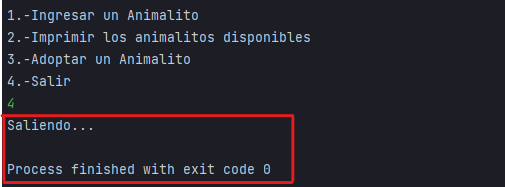

**Con esta información podrás utilizar todo las funciones del código sin ningún problema.**